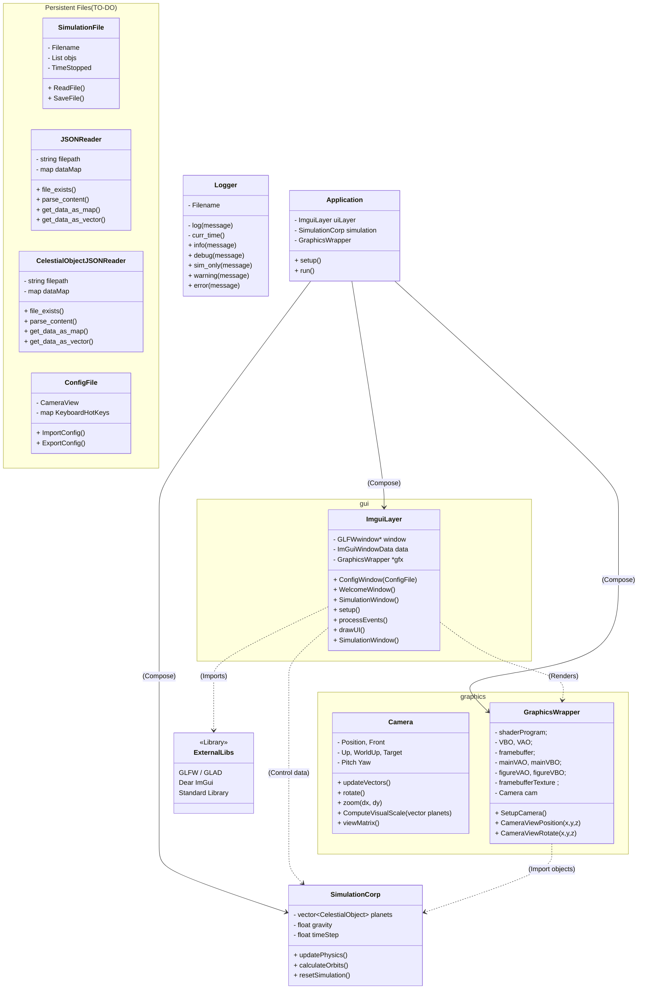
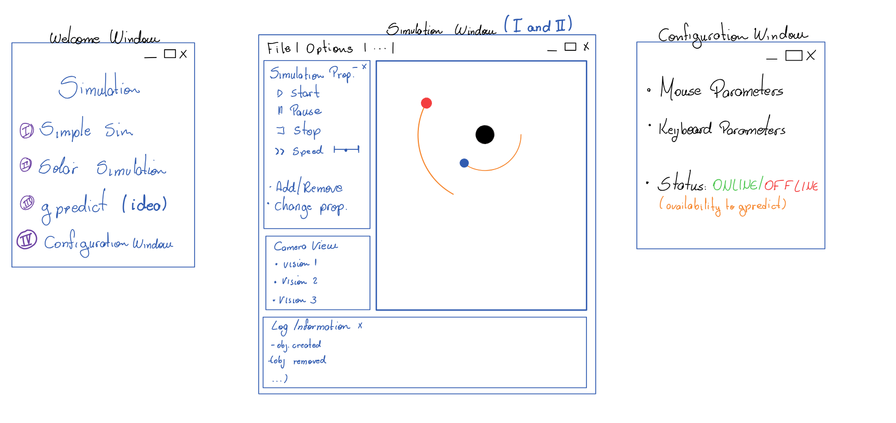

# Introduction
Notre intention dans ce projet est d’associer des concepts d’organisation de l’architecture du code - avec l’utilisation, par exemple, de design pattern - avec la programmation orientée objet. Dans un premier temps, nous utiliserons des bibliothèques open-source comme [Imgui](https://github.com/ocornut/imgui) et [Glad](https://github.com/Dav1dde/glad). Cela permet même que le projet soit disponible pour différentes plates-formes de systèmes d’exploitation.


# date livraison - 26 janv
## Critéres de evaluation
- Qualidade de codigo
	- boa construção
	- evitar estilo de C
	- comentaire -> documentation (dOxygen)s
- Qualidade de Arquitetura
- Qualidade de apresentação
- Conjuntos de função
	- funções complicadas de se realizar, trade-off
	- riqueza de dificuldade.


<!-- rapidJSON -para salvar dados de ficheiro -->
<!-- - Gpredict -->

# Installing Dependences (LINUX):

## SDL
```sh
git clone https://github.com/libsdl-org/SDL.git -b SDL2
cd SDL
mkdir build
cd build
../configure
make
sudo make install
```
## LIB. GLFW3

```sh
sudo apt install libglfw3 libglfw3-dev
```

## Download and Execute

```sh
#This install imgui and glad in the machine
git clone --recursive https://github.com/mbgustav/PlanetarySystem
mkdir build ; cd build
cmake ..
make

```


## System Organization



## WINDOW LANDING PAGES
Drafted ideas about how the pages are expected to be.


