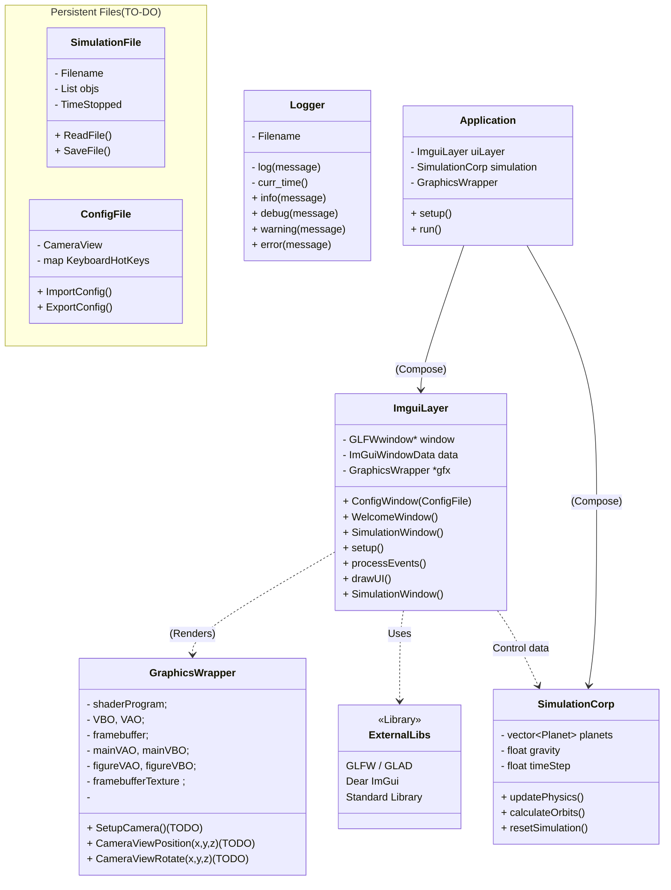

# Introduction
This project demonstrates a 3D Planetary Simulation. Considering that this project consists on concept application about Oriented Object Programming in practice, we decided to develop a robust simulation using some well known libraries in this subject:
- [Imgui](https://github.com/ocornut/imgui)
- [Glad](https://github.com/Dav1dde/glad)

<!-- - Gpredict -->

## System Organization

## WINDOW LANDING PAGES
Drafted ideas about how the pages are expected to be.

